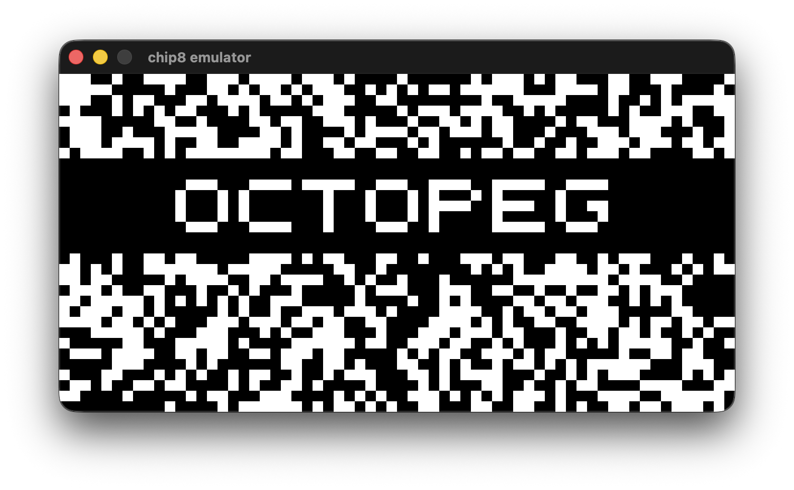

# Chip 8 Emulator

This is a CHIP-8 emulator written in C using raylib.



## Build (macOS/Linux)

```bash
cmake -S . -B build-native
cmake --build build-native -j
```

## Run

```bash
./build-native/chip8_emulator <path-to-rom.ch8>
```
